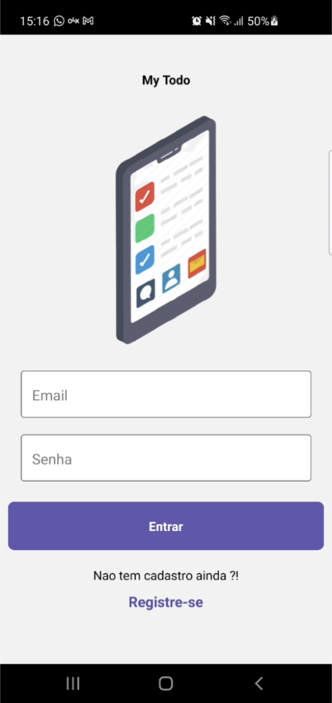
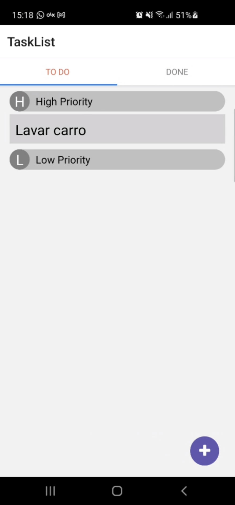
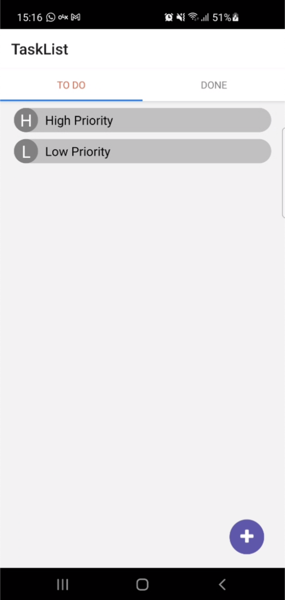
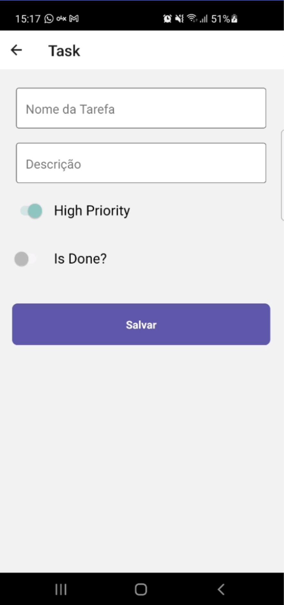

## IESB - Todo Manager

## React Native Concepts

Project for studies about concepts with React Native and Firebase integration

 

## Techs

- [x] React Native
- [x] Styled Components
- [x] Firebase
- [x] React Native Paper for UI

## Usage

1. Run `yarn` for install dependencies. 
1. Run `react-native run-ios or run-android` . 

## Final Result

 

<table>
  <tr>
    <td>Login View</td>
    <td>Holiday Mention</td>
    <td>Present day in purple and selected day in pink</td>
  </tr>
  <tr>
    <td></td>
    <td></td>
    <td></td>
  </tr>
    <tr>
    <td></td>
    </tr>
 </table>

## License

[GPL-3.0](emersonjds@fsf.com) © Emerson Silva
